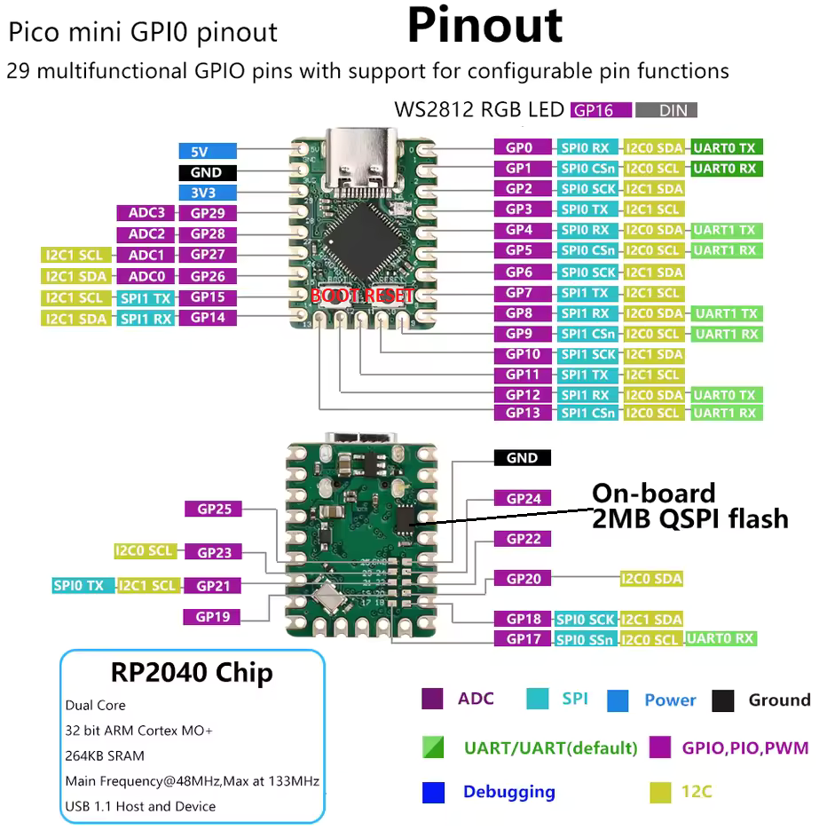

# rp2040_MicroPython_blink

1. Завантажуємо прошивку [uf2](RPI_PICO-20250415-v1.25.0.uf2) з micropython.org/download/?mcu=rp2040
2. Затискаємо кнопку BOOT і перетягуємо uf2 в папку rp2040
3. Підключаємось через віртуальний ком порт в онлайн ide https://viper-ide.org
4. Створюємо [boot.py](boot.py)
5. hard або soft reset і профіт

---

Для Arduino IDE

`https://github.com/earlephilhower/arduino-pico/releases/download/global/package_rp2040_index.json`
